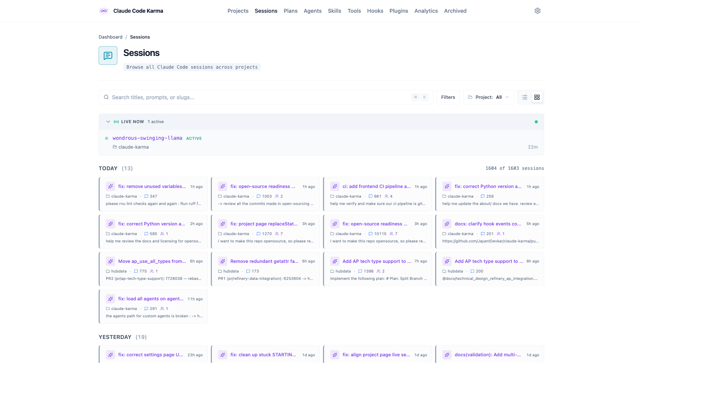
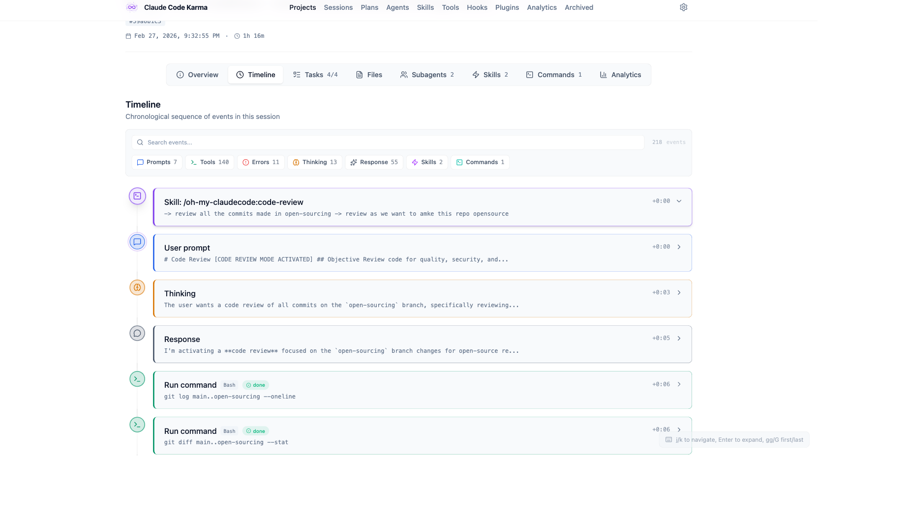
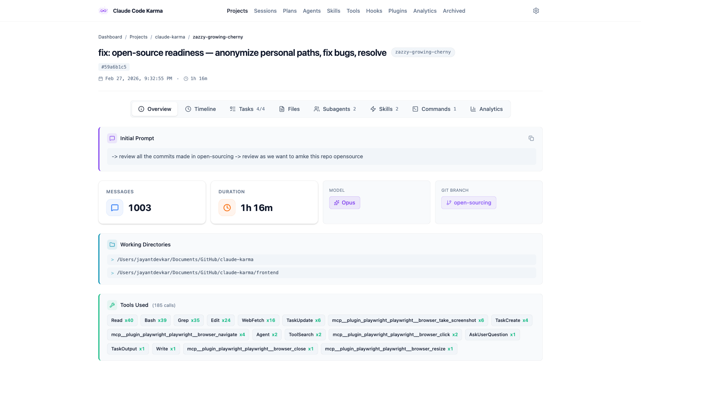
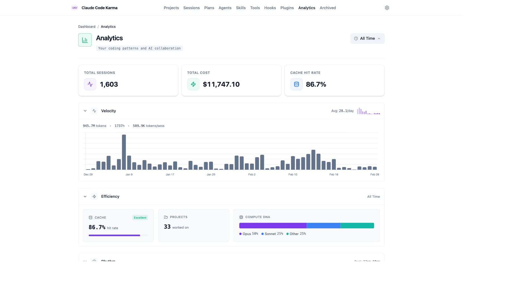
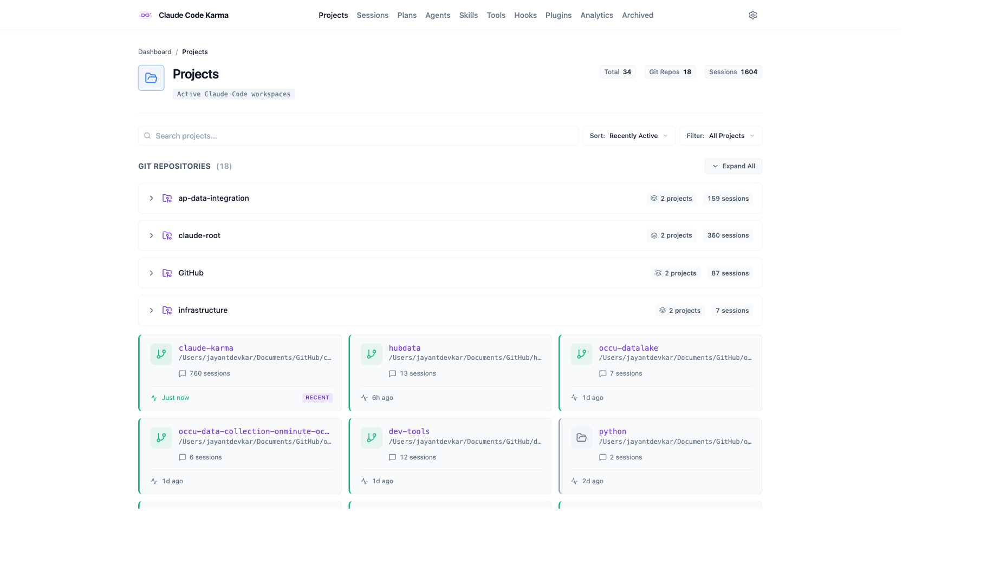
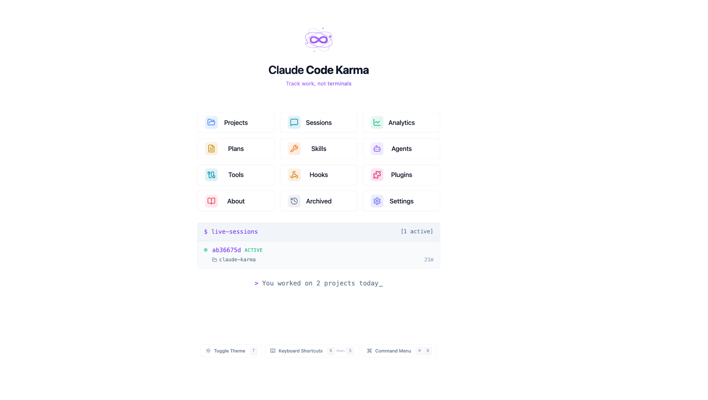

<p align="center">
  
</p>

<p align="center">
  An open-source dashboard for monitoring and analyzing your Claude Code sessions — token usage, tool calls, session timelines, and live hooks, all in one place.
</p>

<p align="center">
  <a href="https://www.apache.org/licenses/LICENSE-2.0"></a>
  <a href="https://www.python.org/"></a>
  <a href="https://nodejs.org/"></a>
  <a href="https://kit.svelte.dev/"></a>
</p>

<br />

<p align="center">
  
</p>

## Features

- **Session Browser** — Browse all sessions across projects with live status, search, and filters
- **Timeline View** — Chronological event timeline showing prompts, tool calls, thinking, and responses
- **Live Sessions** — Real-time session monitoring via Claude Code hooks
- **Analytics** — Token usage, costs, velocity trends, cache hit rates, and coding rhythm
- **Subagent Tracking** — Monitor spawned agents and their activity within sessions
- **Tool & Skill Analytics** — Track which tools and skills are most used across sessions
- **Plans Browser** — View plans created during sessions and their execution status
- **Hooks & Plugins** — Browse installed Claude Code hooks and plugins
- **Command Palette** — Quick navigation with `Ctrl+K` / `Cmd+K`
- **Session Search** — Full-text search across all session titles, prompts, and slugs
- **File History** — Track file changes across sessions

<details>
<summary><strong>More screenshots</strong></summary>
<br />

### Session Timeline


### Session Overview


### Analytics


### Projects


### Home


</details>

## Quick Start

```bash
# Clone the repository
git clone https://github.com/JayantDevkar/claude-karma.git
cd claude-karma

# Start API (Terminal 1)
cd api
pip install -e ".[dev]" && pip install -r requirements.txt
uvicorn main:app --reload --port 8000

# Start Frontend (Terminal 2)
cd frontend
npm install && npm run dev
```

Open **http://localhost:5173** to view the dashboard.

For detailed setup including live session tracking, see [SETUP.md](./SETUP.md).

## How It Works

```
~/.claude/projects/{encoded-path}/{uuid}.jsonl
    ↓
API parses JSONL → Pydantic models
    ↓
FastAPI endpoints on port 8000
    ↓
SvelteKit dashboard on port 5173
```

Claude Code Karma reads Claude Code's local storage and presents it through an interactive dashboard:

1. **Storage** — Claude Code writes session data to `~/.claude/projects/`
2. **Parsing** — The API parses JSONL files into structured Pydantic models
3. **Database** — Metadata is indexed in SQLite at `~/.claude_karma/metadata.db`
4. **API** — FastAPI serves REST endpoints for querying session data
5. **Frontend** — SvelteKit renders interactive visualizations

## Project Structure

```
claude-karma/
├── api/                    # FastAPI backend (Python) — port 8000
│   ├── models/             # Pydantic models for Claude Code data
│   ├── routers/            # API endpoints
│   └── services/           # Business logic
├── frontend/               # SvelteKit frontend (Svelte 5) — port 5173
│   ├── src/routes/         # Pages
│   └── src/lib/            # Components and utilities
├── captain-hook/           # Pydantic library for Claude Code hooks
└── hooks/                  # Hook scripts (symlinked to ~/.claude/hooks/)
    ├── live_session_tracker.py
    ├── session_title_generator.py
    └── plan_approval.py
```

## Live Session Tracking

Enable real-time session monitoring by installing Claude Code hooks. See [SETUP.md](./SETUP.md#live-sessions-tracking-optional) for setup instructions.

| State | Meaning |
|-------|---------|
| `LIVE` | Session actively running |
| `WAITING` | Waiting for user input |
| `STOPPED` | Agent finished, session open |
| `STALE` | User idle 60+ seconds |
| `ENDED` | Session terminated |

## Technology Stack

### Backend
- **Python 3.9+** with **FastAPI** and **Pydantic 2.x**
- **SQLite** for metadata indexing
- **pytest** for testing, **ruff** for linting

### Frontend
- **SvelteKit 2** with **Svelte 5** runes
- **Tailwind CSS 4** for styling
- **Chart.js 4** for visualizations
- **bits-ui** for accessible UI primitives
- **TypeScript** for type safety

### Libraries
- **captain-hook** — Type-safe Pydantic models for Claude Code's 10 hook types

## API Endpoints

<details>
<summary>View all endpoints</summary>

### Core

| Endpoint | Description |
|----------|-------------|
| `GET /projects` | List all projects |
| `GET /projects/{encoded_name}` | Project details with sessions |
| `GET /sessions/{uuid}` | Session details |
| `GET /sessions/{uuid}/timeline` | Session event timeline |
| `GET /sessions/{uuid}/tools` | Tool usage breakdown |
| `GET /sessions/{uuid}/file-activity` | File operations |
| `GET /sessions/{uuid}/subagents` | Subagent activity |

### Analytics

| Endpoint | Description |
|----------|-------------|
| `GET /analytics/projects/{encoded_name}` | Project analytics |
| `GET /analytics/dashboard` | Global dashboard metrics |

### Agents, Skills & Live Sessions

| Endpoint | Description |
|----------|-------------|
| `GET /agents` | List all agents |
| `GET /agents/{name}` | Agent details |
| `GET /skills` | List all skills |
| `GET /live-sessions` | Real-time session state |

</details>

## Contributing

Contributions are welcome! Please see [CONTRIBUTING.md](./CONTRIBUTING.md) for guidelines on:

- Reporting bugs
- Suggesting features
- Development setup
- Code style and testing
- Pull request process

## License

This project is licensed under the Apache License 2.0. See [LICENSE](./LICENSE) for details.

## Questions?

- See [SETUP.md](./SETUP.md) for installation and configuration help
- Check [CLAUDE.md](./CLAUDE.md) for development guidance
- Review existing [GitHub Issues](https://github.com/JayantDevkar/claude-karma/issues)

---

Built and maintained by [Jayant Devkar](https://github.com/JayantDevkar)
